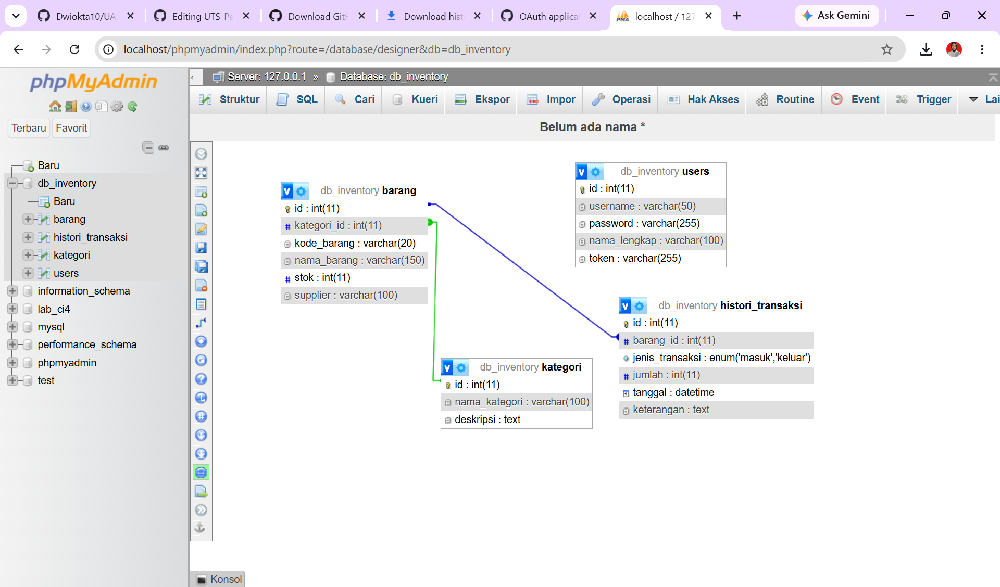
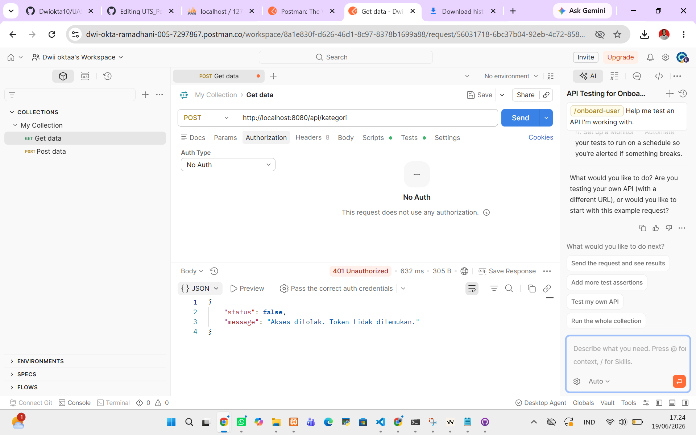
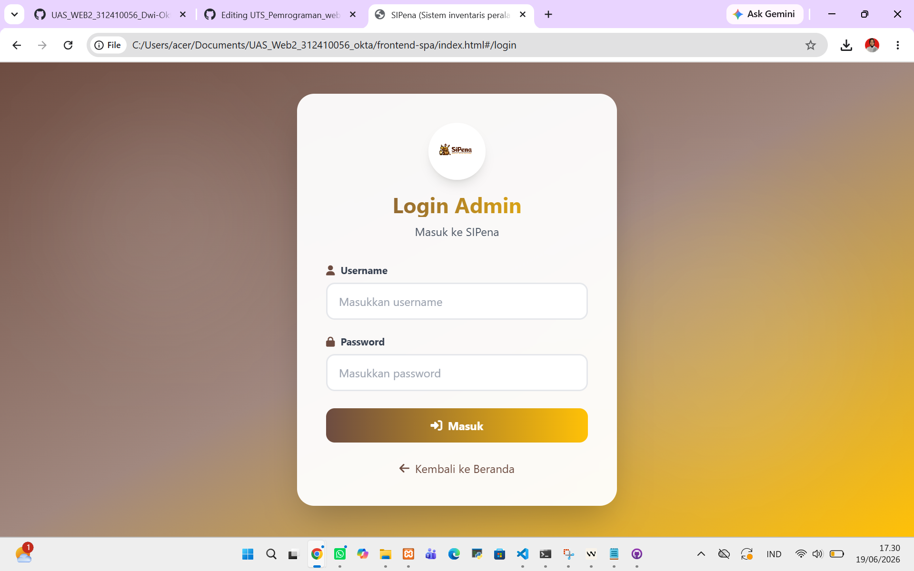

# Projek UAS PEMROGRAMAN WEB 2 SEMESTER 4
|                |                    |
| -------------- | ------------------ |
|      _Nama_    | Dwi Okta Ramadhani |
|      _NIM_     |      312410056     |
|     _Kelas_    |      TI.24.A1      |
|  _Mata Kuliah_ | Pemrograman Web 2  |
| _Dosen Pengampu_ | Bapak Agung Nugroho, S.Kom., M.Kom. |
|  _Link Youtube_ | https://youtu.be/dRdA3LH-X_8 |

Deskripsi Proyek

SI PENA (Sistem Inventaris Peralatan Pramuka) merupakan aplikasi berbasis web yang dirancang untuk membantu proses pengelolaan inventaris peralatan Pramuka secara digital. Sistem ini memudahkan administrator dalam melakukan pendataan perlengkapan Pramuka, pengelompokan kategori peralatan, pengelolaan stok, serta pencatatan histori barang masuk dan barang keluar secara terstruktur dan terdokumentasi.

Aplikasi ini dikembangkan sebagai proyek Ujian Akhir Semester (UAS) Mata Kuliah Pemrograman Web 2 dengan menerapkan konsep Decoupled Architecture, yaitu pemisahan antara Backend API dan Frontend SPA. Dengan arsitektur ini, sistem menjadi lebih fleksibel, mudah dikembangkan, dan mampu memberikan performa yang lebih baik dalam pengelolaan data inventaris.

Sistem informasi manajemen inventaris ini dibangun dengan arsitektur *Decoupled* (terpisah) untuk mendigitalisasi pencatatan aset institusi pendidikan, meliputi pendataan barang, kategori, serta histori barang masuk dan keluar.

## 🛠 Teknologi Utama
- **Backend:** CodeIgniter 4 (RESTful API, Resource Controller, Filters untuk Token/CORS)
- **Frontend:** VueJS 3 (SPA, Vue Router), Axios (Interceptors)
- **UI:** TailwindCSS via CDN
- **Database:** MySQL

## 🚀 Panduan Instalasi
1. **Backend:** Buka terminal pada direktori `backend-api`, sesuaikan koneksi database di `.env`, lalu jalankan `C:\xampp\php\php.exe spark serve`.
2. **Frontend:** Buka direktori `frontend-spa` dan jalankan `index.html` menggunakan Live Server.
3. Akses aplikasi melalui browser dan login sebagai Administrator.

## 📸 Dokumentasi Visual

### 1. Skema Relasi Database

### 2. Keamanan API (Uji Coba Error 401 via Postman)

### 3. Halaman Login

### 4. Halaman Dashboard Admin

### 5. Visualisasi Tabel Data 

### 6. Form Modal Interaktif (Tambah/Edit)

